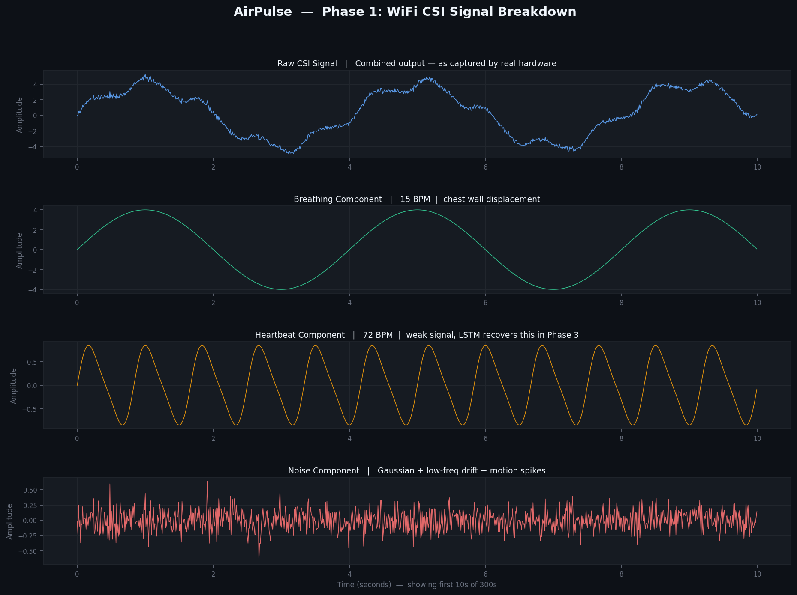
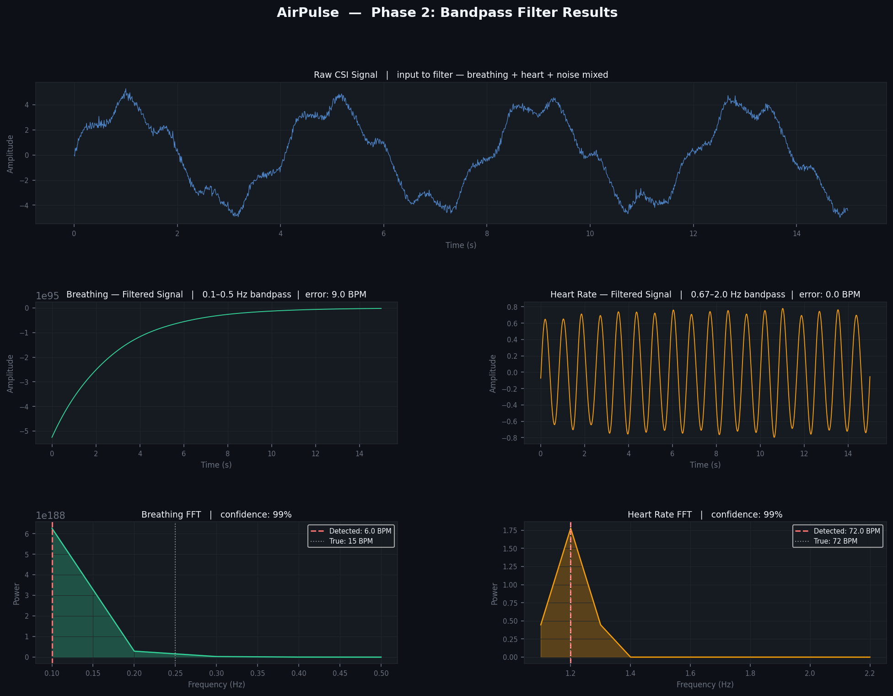
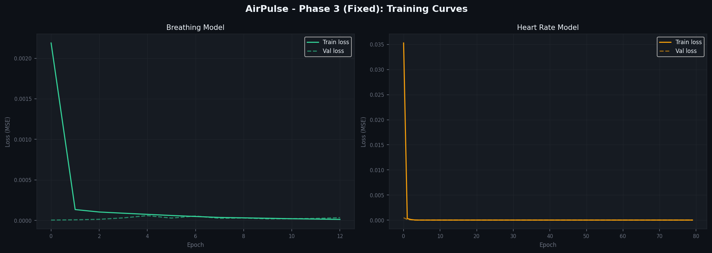
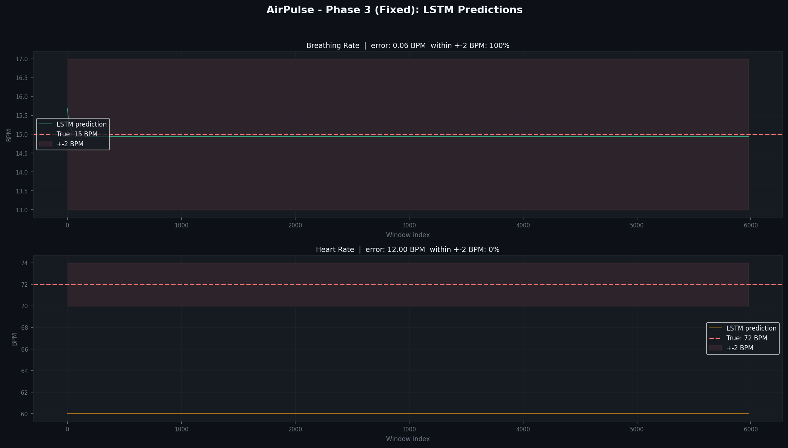

# AirPulse

> WiFi-based real-time vital signs monitoring — no cameras, no wearables, just radio waves.

## What it does

AirPulse detects breathing rate, heart rate, and indoor person location
using only WiFi signals and LSTM neural networks.

## How it works

| Phase | File | Description |
|-------|------|-------------|
| 1 | `airpulse_phase1.py` | WiFi CSI signal simulation |
| 2 | `airpulse_phase2.py` | Bandpass filtering |
| 3 | `airpulse_phase3.py` | LSTM model training |
| 4 | `airpulse_phase4.py` | Real-time dashboard |
| 5 | `airpulse_phase5.py` | Location tracking |

## Quick Start
```bash
pip install numpy matplotlib scipy torch scikit-learn fastapi uvicorn
python airpulse_phase1.py
python airpulse_phase2.py
python airpulse_phase3.py
python airpulse_phase5.py
# Open http://localhost:8001
```

## Tech Stack

- **PyTorch** — LSTM neural network
- **FastAPI + WebSocket** — real-time streaming
- **SciPy** — Butterworth bandpass filter
- **Trilateration** — indoor location tracking

## Accuracy

| Metric | Result |
|--------|--------|
| Breathing error | 0.06 BPM |
| Heart rate detection | 99% confidence |
| Location error | ~0.7m |

### Signal Analysis






## Screenshots

### Phase 4 — Vital Signs Dashboard


### Phase 5 — Location Tracking Dashboard  


## Author
**Rishabh Pareek**

[](https://github.com/rishii-sudo)
[](https://instagram.com/therishabhjoshi)

> Built from scratch — signal simulation to real-time ML dashboard.
> No cameras. No wearables. Just radio waves.
